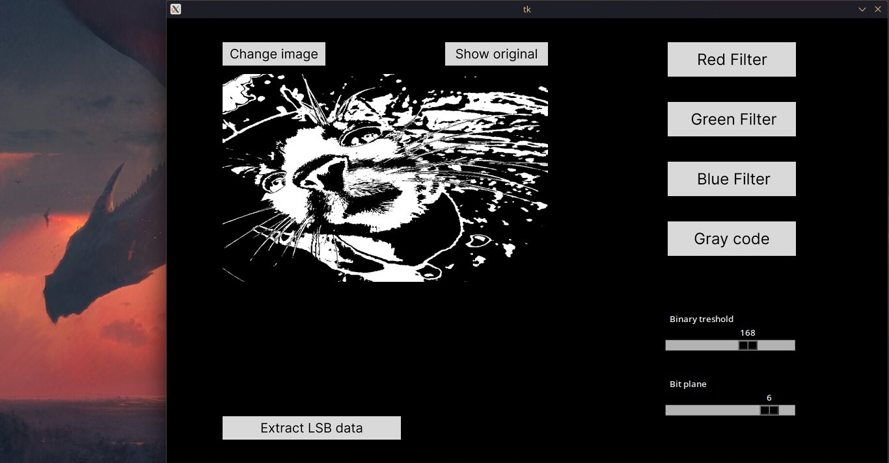
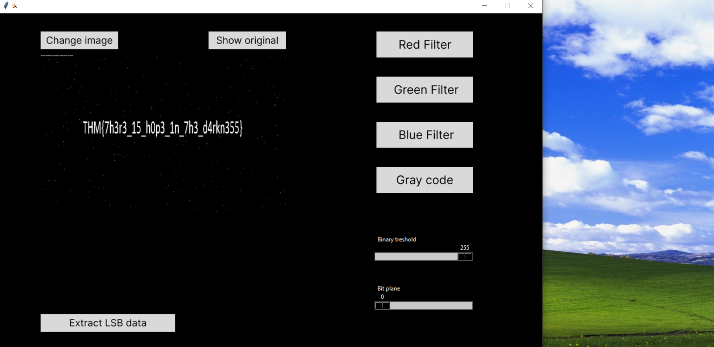

# Immage

Immage (i'm mage :crystal_ball:)  - an image analysis tool (steganography) and hidden data extractor. The tool applies different steganography algorithms (pixel color manipulations and bit manipulations) on the imported image in order to find hidden artifacts.

Written in :snake: Python. 
GUI - Tkinter.
GUI Design - Figma, Tkdesigner.
# Example

<!-- -->


# Installation
## From GitHub release
Click on GitHub *Releases* section and download binary for a specific OS
## From source
1) Clone the repo
```
git clone https://github.com/SafarSoFar/immage
```
2) Download *pyinstaller*, *tkinter* and *pillow*
```
pip install pyinstaller, tk, pillow
```
3) Build for Windows/Linux

Windows PyInstaller arguments:
```
pyinstaller --onefile --add-data "assets/*.png;assets/" --name immage immage_app.py
```
Linux PyInstaller arguments:
```
pyinstaller execution config: pyinstaller --onefile --name immage --hidden-import='PIL._tkinter_finder' --add-data "assets/*.png:assets/" immage_app.py
```

# Usage
1) Execute the program binary.
    Linux:
    ```
    ./immage
    ```
    Windows:
    Click on *immage.exe* or type in a console
    ```
    .\immage.exe
    ```
2) The GUI application will pop up
3) Import an image via *Change Image* GUI button


Linux v0.1-beta build : Python 3.9.19
Windows v0.1-beta bulld : Python 3.9.0